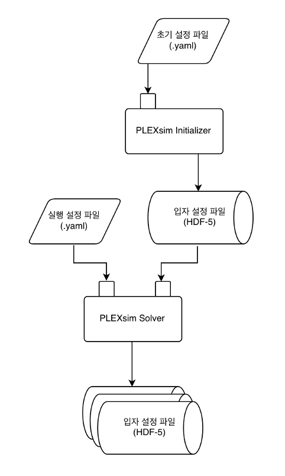
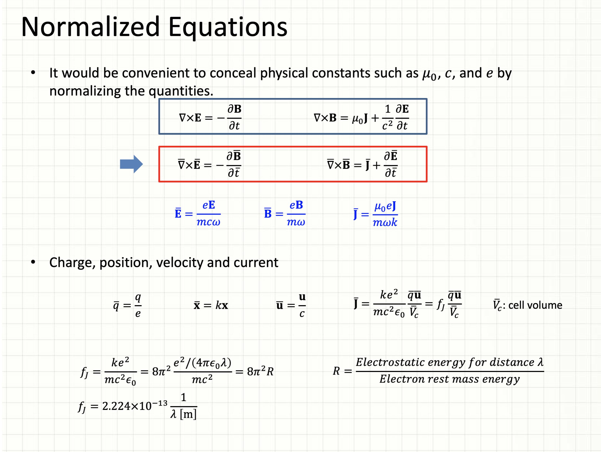
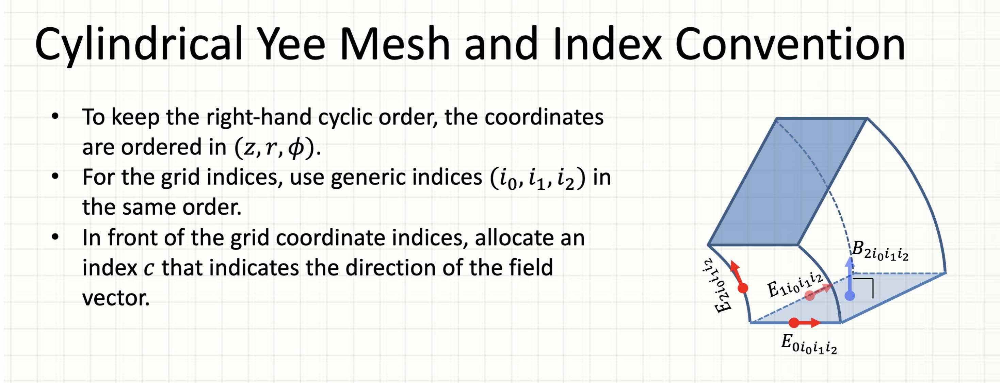
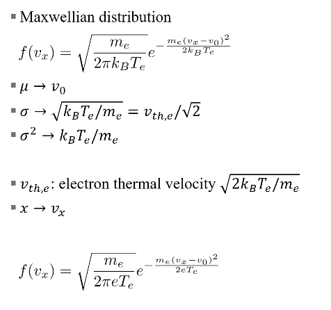

# PLEXsim Initializer

PLasma EXtensible Simulation (PLEXsim) Initializer 사용 설명입니다.


## Install
1. git clone
```sh
$ git clone https://github.com/notesquare/plexsim-initializer.git
```

2. 의존 라이브러리 설치

```sh
$ pip install -r requirements.txt

# or

$ conda env update -n plexsim --file environment.yaml
```
`!` 병렬로 입자를 생성하는 `mpi` 모드를 사용하기 위해서는 추가적인 설정이 필요합니다. [link](#simulation)

## Overview


PLEXsim Initializer는 초기 설정 정보가 담겨 있는 `YAML` 파일을 입력받아 입자를 로드하여 `HDF-5` 파일로 저장합니다. 만들어진 입자 설정 파일은 PLEXsim Solver([Core](https://github.com/notesquare/plexsim-core) 및 [Distributed](https://github.com/notesquare/plexsim))를 통해 시뮬레이션합니다.

### Coordinate Systems
PLEXsim은 Cartesian 및 Cylindrical coordinate system를 지원하며 Initializer를 실행할 때 초기 설정 파일에서 두 가지 중 하나를 선택할 수 있습니다. 또한, PLEXsim Solver에서 Cartesian coordinate system은 Implicit method를, Cylindrical coordinate system은 Implicit과 Explicit method를 지원합니다. 각각의 좌표계 및 모드에서 정의되는 물리량 및 지원되는 기능들이 다르므로 [Config](#config)의 내용에 유의하여 입력 자료 생성 및 결과 분석에 활용하시기 바랍니다.





Cartesian coordinate system에서는 초기 설정 파일(`.yaml`)과 입자 설정 파일(`.h5`)에서 정의되는 물리량이 모두 SI unit이며, electric field(E)는 grid에서, magnetic field(B)는 cell center에서 각각 정의됩니다. Cylindrical coordinate system의 경우 일부 물리량은 normalized된 값을 사용하며, E, B가 위 그림과 같은 YEE mesh에서 정의됩니다.


## Config

### 예시
e.g. `config.yaml`
```yaml
initializer: maxwellian

environment:
  coordinate_system: cylindrical
  grid_shape: [44, 75, 30]
  cell_size: [0.14726215, 0.05645049]
  scale_length: 1.
  r0: 0.53996123
  external_magnetic_field: [0, 0, 0]
  external_electric_field: [0, 0, 0]
  induced_magnetic_field: ./data/input-cylindrical-39915/B_cyl.npy
  induced_electric_field: [0, 0, 0]
  vacuum_current_density: ./data/input-cylindrical-39915/J_ext_yee.npy
  field_dtype: fp64
  relative_permittivity: 1
  relative_permeability: 1

grids:
  -
    species: electron
    dtype:
      X: fp64
      U: fp64
    n_splits: 2
    n_computational_to_physical: 2.11e+10
    initial_condition:
      temperature: ./data/input-cylindrical-39915/Te.npy  # [eV]
      density: ./data/input-cylindrical-39915/ne.npy  # [m^-3]
      current_density: ./data/input-cylindrical-39915/J.npy

      tracking:
        n_particles: 200
        sample: random

  -
    species: ion
    dtype:
      X: fp64
      U: fp64
    n_splits: 2
    n_computational_to_physical: 2.11e+10
    initial_condition:
      temperature: ./data/input-cylindrical-39915/Ti.npy  # [eV]
      density: ./data/input-cylindrical-39915/ni.npy  # [m^-3]

      tracking:
        n_particles: 200
        sample: random

simulation:
  backend: mpi
  chunk_size: 1.e+6
  iteration_encoding: file
  save_state: No

```

### 설명

#### Initializer
_{​​​​​​​'​​​​​​maxwellian', 'random'}​​​​​​_   
- _'maxwellian'_ : 입자 분포 및 속도를 maxwellian distribution을 따르도록 초기화.
  - 
  - `grids.initial_condition`에 `temperature` 및 `density` 입력 필요
  - [`dev/cylindrical`](https://github.com/notesquare/plexsim-initializer/tree/dev/cylindrical) branch에서 Initializer의 노이즈 감쇄를 위한 여러 기법들을 적용하여 개발 중
    1. quiet start : v<sub>half</sub> = v<sub>d</sub> + v<sub>th</sub>, v<sup>*</sup><sub>half</sub> = v<sub>d</sub> - v<sub>th</sub> 으로 cell내의 온도 노이즈 상쇄
    2. pseudo-random (halton sequence) : 유사 난수를 사용해 cell 내 균일한 위치 분포
    3. rejection Method : cell 내의 균일 분포를 2D 격자점에 linear 한 분포로 수정
    4. Multiple v_table generation : velocity distribution의 𝑑𝑣 간격을 각 cell 내의 입자에 맞게 수정
    5. cell 내의 입자온도, 전류 정보를 2D 격자점에 linear 한 분포로 수정
- _'random'_: 입자 위치를 랜덤(uniformly) 하게 생성.
  - `grids.initial_condition`에 `n_particles` 및 `avg_velocity` 입력 필요

#### Environment
```yaml
environment:
  coordinate_system: cylindrical
  grid_shape: [44, 75, 30]
  cell_size: [0.14726215, 0.05645049]
  scale_length: 1.
  r0: 0.53996123
  external_magnetic_field: [0, 0, 0]
  external_electric_field: [0, 0, 0]
  induced_magnetic_field: ./data/input-cylindrical-39915/B_cyl.npy
  induced_electric_field: [0, 0, 0]
  vacuum_current_density: ./data/input-cylindrical-39915/J_ext_yee.npy
  field_dtype: fp64
  relative_permittivity: 1
  relative_permeability: 1
```
- **coordinate_system**: {_'cartesian'_, _'cylindrical'_}
  - 좌표계를 설정합니다.
- **grid_shape**: _list_
  - 전체 격자 `grid`의 크기를 지정합니다.
  - `cartesian`: 단위 격자 `cell`의 x, y, z축 방향 개수를 리스트로 받습니다.
  - `cylindrical`: z, r, phi축 방향 개수를 리스트로 받습니다.
- **cell_size**: _list_
  - `cartesian`: 단위 격자의 x, y, z축 방향 길이[m]를 지정합니다.
  - `cylindrical`: 단위 격자의 z, r축 방향 길이를 지정합니다.
    - SI[m]로 환산 시 `cell_size / (2 * pi / scale_length)`로 환산됩니다.
- **r0**: _float_
  - `cylindrical` only
  - SI[m]로 환산 시 `r0 / (2 * pi / scale_length)`로 환산됩니다.
- **scale_length**: _float_
  - `cylindrical` only
  - characteristic frequency `w = 2 * pi * c / scale_length`
- **external_magnetic_field**: _list or file_
  - 초기 외부 자기장을 설정합니다.
  - `cartesian`: cell center에서 정의됩니다.
    - _list_: x, y, z 방향의 자기장 [T]을 지정합니다. 모든 cell center에 같은 크기로 할당됩니다.
    - _file_: 각 cell center의 자기장 정보를 담고 있는 `.npy` 파일의 경로를 지정합니다.
      - e.g. `grid_shape == [138, 138, 64]` 인 경우 `external_magnetic_field의 shape == [138, 138, 64, 3]`이어야 합니다. (마지막 차원의 3은 B<sub>x</sub>, B<sub>y</sub>, B<sub>z</sub> 순서)
  - `cylindrical`: YEE mesh (face center)에서 정의됩니다. [link](#coordinate-systems)
    - _list_: z, r, phi 방향의 자기장을 지정합니다. 모든 face center에 같은 크기로 할당됩니다.
    - _file_: 각 지점의 자기장 정보를 담고 있는 `.npy` 파일의 경로를 지정합니다.
- **induced_magnetic_field**: _list or file, optional_
  - 초기 유도 자기장을 설정합니다. 입력 형식은 `external_magnetic_field`와 같습니다. 입력하지 않은 경우 0으로 초기화됩니다.
- **external_electric_field**: _list or file_
  - 초기 외부 전기장을 설정합니다. 입력 형식은 `external_magnetic_field`와 같습니다.
  - `cartesian`: [V/m]
    - 각 node에서 정의됩니다. `shape == (nx + 1, ny + 1, nz + 1, 3)`
  - `cylindrical`: [link](#coordinate-systems)
- **induced_electric_field**: _list or file, optional_
  - 초기 유도 전기장을 설정합니다. 입력 형식은 `external_electric_field`와 같습니다. 입력하지 않은 경우 0으로 초기화됩니다.
- **vacuum_current_density**: _list or file, optional_
  - SI unit, 전기장과 같은 위치에서 정의됩니다.
- **field_dtype**: _{'fp32', 'fp64'}_
  - 전기장과 자기장 배열의 부동 소수점 형식을 지정합니다. 32비트 단일 정밀도 형식과 64비트 이중 정밀도 형식 중 선택할 수 있습니다.
- **valid_cell_coords**: _file, optional_
  - `cartesian` only
  - 시뮬레이션 연산을 수행할 cell 좌표 정보를 담고 있는 `.npy`파일 경로. 설정한 좌표를 벗어나 입자가 이동하면 사라집니다.
  - e.g. `[[0, 0, 0], [0, 0, 1], ..., [137, 137, 63]]`
  - 입력하지 않을 경우 `grid_shape` 크기의 직육면체가 시뮬레이션 공간이 됩니다.
- {**constant_external_field_node_coords, constant_induced_field_node_coords, constant_external_field_center_coords, constant_induced_field_center_coords**}: _file, optional_
  - `cartesian` only
  - 초기 입력값으로 자기장, 전기장 값을 고정할 격자점 좌표를 담고 있는 `.npy`파일 경로. 장이 경계면에 반사되는 것을 막기 위해 사용.
  - e.g `[[0, 0, 0], [0, 0, 1], ..., [138, 138, 64]]`
- **vacuum_cell_mask**: _file, optional_
  - `cylindrical-explicit` only
  - lambda damping을 위한 mask. `(nz, nr, nphi)` 또는 `(nz, nr)` shape의 boolean array
  - `E[vacuum_cell_mask] *= damping_factor` (`damping_factor`는 PLEXsim Solver의 config(`.yaml`)에서 정의)
  - `B[vacuum_cell_mask] = damping_factor * B[vacuum_cell_mask] + (1 - damping_factor) * B_fixed[vacuum_cell_mask]` (`B_fixed`는 Cycle 0에서의 total B)
  - particle lambda damping: Particle Mover 이후 `vacuum_cell_mask`내에 있는 입자 속도 `U = 0.98 * U`
- **relative_permittivity**: _float, optional_
  - [relative permittivity](https://en.wikipedia.org/wiki/Relative_permittivity) 를 설정합니다. 입력하지 않을 경우 1로 설정됩니다.
- **relative_permeability**: _float, optional_
  - [relative permeability](https://en.wikipedia.org/wiki/Relative_permeability) 를 설정합니다. 입력하지 않을 경우 1로 설정됩니다.

#### Grids

```yaml
grids:
  -
    species: electron
    q: -1
    m: 1
    dtype:
      X: fp64
      U: fp64
    n_splits: 2
    n_computational_to_physical: 2.11e+10
    initial_condition:
      temperature: ./data/input-cylindrical-39915/Te.npy  # [eV]
      density: ./data/input-cylindrical-39915/ne.npy  # [m^-3]
      current_density: ./data/input-cylindrical-39915/J.npy
      # n_particles: 1.e+3
      # avg_velocity: 3.e+6  # [m/s]
      tracking:
        n_particles: 200
        sample: random
```
각 입자에 대한 설정을 목록(`-`)으로 나누어 지정합니다. 목록의 요소를 추가하거나 제거하여 몇 종류의 입자를 포함할지 선택할 수 있습니다.
- **species**: _str_
  - 입자 이름을 지정합니다. _{'electron', 'ion'}_ 중에서 선택할 경우 다음의 `q`, `m` 옵션을 입력하지 않아도 자동으로 계산됩니다.
- **q, m**: _float_
  - 각각 전하량과 질량을 지정합니다.
  - `cartesian`: SI unit
    - (electron) q = -1.602e-19
    - (electron) m = 9.11e-31
  - `cylindrical`: normalized unit
    - (electron) q = -1
    - (electron) m = 1
- **dtype**: _{'fp32', 'fp64'}_
  - 입자 위치(X) 및 속도(U) 배열의 부동 소수점 형식을 지정합니다.
- **n_splits**: _**int**, optional._
  - PLEXsim Distributed (멀티 노드, 멀티 GPU)용 옵션
  - 각 `grid`를 몇 개의 부분공간으로 나눌지 지정합니다. 각 부분공간은 공간을 채우는 hilbert curve를 따라 cell을 기준으로 입자를 균등하게 나누며, Plexsim Solver 에서 GPU를 사용하는 경우 GPU 수보다 각 입자의 `n_splits`의 합이 작거나 같으면 GPU를 하나씩 할당합니다.
  - e.g. GPU가 4개 있고 입자가 두 종류이면서 그 수가 비슷하다면, 각각의 `n_splits: 2`로 설정하면 GPU를 최대로 사용할 수 있습니다.
- **n_computational_to_physical**: _int, optional_
  - 1개의 컴퓨터 상 입자가 몇 개의 실제 입자를 대표(super particle)하는지 지정합니다.
- **initial_condition**
  - **temperature**: _file, required for maxwellian initializer_
    - 각 격자점에 해당하는 온도[eV] 정보를 담고 있는 `.npy` 파일 경로. [`initializer`](#initializer) 가 `maxwellian`일 경우 필요합니다.
    - `cartesian` e.g. `grid_shape == [138, 138, 64]`인 경우 `temperature shape == [139, 139, 65]`이어야 합니다.
    - `cylindrical` e.g. `grid_shape == [138, 138, 64]`인 경우 `temperature shape == [139, 139, 64]`이어야 합니다.
  - **density**: _file, required for maxwellian initializer_
    - 각 격자점에 해당하는 입자 밀도[m^-3^] 정보를 담고 있는 `.npy` 파일 경로. [`initializer`](#initializer) 가 `maxwellian`일 경우 필요합니다.
    - `cartesian` e.g. `grid_shape == [138, 138, 64]`인 경우 `density shape == [139, 139, 65]`이어야 합니다.
    - `cylindrical` e.g. `grid_shape == [138, 138, 64]`인 경우 `density shape == [139, 139, 64]`이어야 합니다.
  - **current_density**: _file, optional for maxwellian initializer_
    - 각 격자점에 해당하는 전류 밀도[Am^-2^] 정보를 담고 있는 `.npy` 파일 경로. [`initializer`](#initializer) 가 `maxwellian`일 경우 입력할 수 있습니다. 입력하지 않으면, 0으로 초기화됩니다.
    - `cartesian` e.g. `grid_shape == [138, 138, 64]`인 경우 `current_density shape == [139, 139, 65, 3]`이어야 합니다.
    - `cylindrical` e.g. `grid_shape == [138, 138, 64]`인 경우 `current_density shape == [139, 139, 64, 3]`이어야 합니다.

  - **n_particles**: _int, required for random initializer_
    - 초기 (계산상) 입자의 수를 지정합니다. [`initializer`](#initializer) 가 `random`일 경우 필요합니다.
  - **avg_velocity**: _float, required for random initializer_
    - 입자의 초기 평균 속력을 지정합니다. [`initializer`](#initializer) 가 `random`일 경우 필요합니다.
  - **tracking**: _optional_
    - **n_particles**: _int_
      - 궤적을 추적하기 위한 입자의 수를 설정합니다.
    - **sample**: _'random'_


#### Simulation

```yaml
simulation:
  backend: mpi
  chunk_size: 1.e+6
  iteration_encoding: file
  save_state: No
```
- **backend**: _{'local', 'mpi'}_
  - _local_: 단일 코어만을 사용하여 Initializer를 실행합니다.
    - e.g. `python -m plexsim_initializer config.yaml test.h5`
  - _mpi_: MPI의 [pool](https://mpi4py.readthedocs.io/en/stable/mpi4py.futures.html#mpi4py.futures.MPIPoolExecutor) 기능을 이용하여 다중 프로세스를 발생시켜 입자를 초기화합니다. 실행 시 `mpirun`을 이용해 실행하며, 관련 옵션을 지정해줍니다. 초기 프로세스는 하나만 생성합니다(`-n 1`).
    - e.g. `mpirun -n 1 python -m plexsim_initializer config.yaml test.h5`
    - Parallel HDF-5와 호환되는 mpi4py가 필요합니다.
- **chunk_size**: _int_
  - `.h5` 파일 dataset의 `chunk size`를 지정합니다.
- **iteration_encoding**: _{'file', 'group'}_
  - `iteration_encoding` 타입을 지정합니다. (https://github.com/openPMD/openPMD-standard/blob/latest/STANDARD.md#iterations-and-time-series 참고)
- **save_state**: _{'True'(='Yes'), 'False'(='No')}_
  - `True`를 선택할 경우 격자점의 `temperature`, `density`, `avg velocity`를 저장합니다. 입자수가 많다면 성능이 저해될 수 있습니다.


## Usage

전체 실행 옵션 출력
```sh
$ python -m plexsim_initializer --help
```

`examples/random` 예시
```sh
$ python -m plexsim_initializer examples/random/config.yaml random_test.h5
```


`examples/maxwellian` 예시
```sh
$ python -m plexsim_initializer examples/maxwellian/config.yaml maxwellian_test.h5
```

실행 결과 화면
```sh
███████████████████████████████████|7/7
Number of particles generated:
 0 (electron) : 305,376,180
 1 (ion) : 305,376,180
```

## Serialize Structure

### 파일 구조

- Format: HDF-5 (openPMD)
- 각각의 입자 species 마다 하나의 HDF-5 파일(e.g. `proj.g0.h5`)을 만들고, 이를 총괄하는 HDF-5 파일(e.g. `proj.h5`)이 하나 있습니다. 총괄 HDF-5 파일만 열어도 모든 정보를 확인할 수 있지만, 일부는 species HDF-5 파일에 External Link로 연결되어 있기 때문에 파일들이 같은 디렉토리에 있어야 합니다.

### 저장 그룹 구조

e.g. `proj.h5`
```
/data
  /{cycle}
    /fields
      /B  # magnetic field, external + induced
      /E  # electric field, external + induced
      /B_induced
      /E_induced 
      /electron_T  # temperature[eV] of electron on node points
      electron_n  # density[m^-3] of electron on node points
      /electron_U  # avg velocity[m/s] of electron on node points
    /particles
      /electron  # all particles
        /position
        /momentum  # dataset x,y,z equal to velocity,
                   # and unitSI equals to mass
        ...
      /electron_tracked  # tracking particles
      /ion
      /ion_tracked
      ...
    /stats
      @n_particles  # same order as config
      @kinetic_E
      ...
/settings
```

### Unit
- `cartesian`: SI unit
- `cylindrical`
  - SI unit: , `data/0/fields/[J_vacuum, {particle}_T, {particle}_U, {particle}_n`, `data/0/stats`
  - Normalized unit: `data/0/fields/[B, E, {particle}_J]`, `data/0/particles/{particle}/[momentum, position]`
    - position: `[0, grid_shape[i])` 사이의 값으로 normalized
    - momentum: `U[m/s] = U * c` (array의 값은 momentum이 아닌 velocity임에 주의)
    - fields: config에서 정의된 바와 같이 normalized

### 그 외 유의사항
- [mpi](#simulation) backend를 선택하여 Initializer를 실행할 경우 `/data/0/particles/{particle}/[momentum, position]`의 array는 가장 마지막 element를 NaN 값으로 채우고 있습니다.
  - e.g. 입자 수가 1000일 경우 1001의 크기를 갖는 배열이 만들어지며 index [0, 999]까지만 값이 채워집니다.
- PLEXsim Solver를 `cylindrical-explicit`으로 실행할 경우 입자 속도가 Lorentz transform되어 저장됩니다. 이는 `data/{cycle}/particles/{particle}/momentum`의 `_is_Lorentz_transformed` attribute 값이 1인 걸로 확인하실 수 있으며 없거나 0인 경우 로렌츠 변환되지 않은 것입니다.
